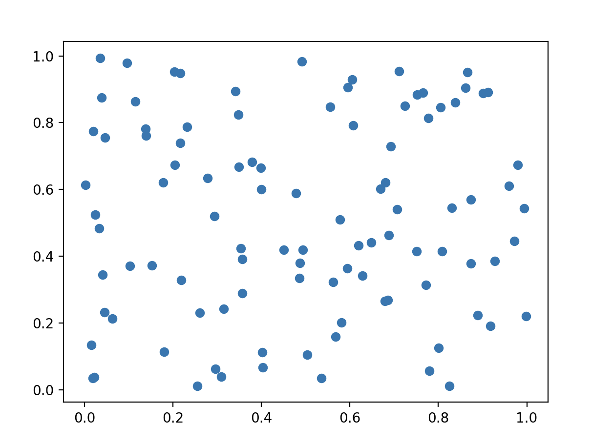

### Урок 4. Функциональное программирование

● Контекст

Корреляция - статистическая мера, используемая для оценки
связи между двумя случайными величинами.

● Ваша задача

Написать скрипт для расчета корреляции Пирсона между
двумя случайными величинами (двумя массивами). Можете
использовать любую парадигму, но рекомендую использовать
функциональную, т.к. в этом примере она значительно
упростит вам жизнь.

