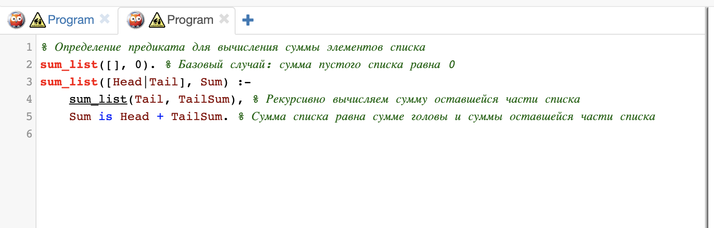
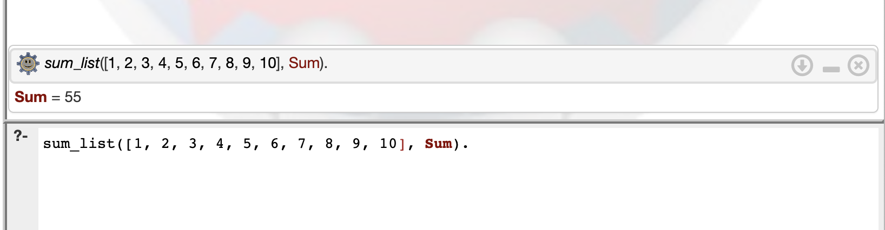

### Урок 5. Логическое программирование

● Контекст

Мы уже видели множество решений этой задачи в различных
стилях. Пришло время решить её с помощью логической
парадигмы.

● Ваша задача

Написать программу на языке Prolog для вычисления суммы
элементов списка. На вход подаётся целочисленный массив.
На выходе - сумма элементов массива.

#### Solution

#### Result
